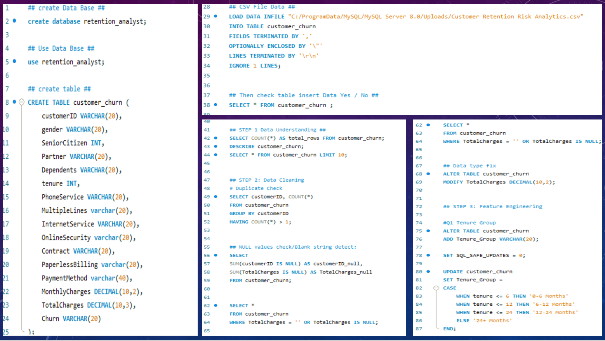
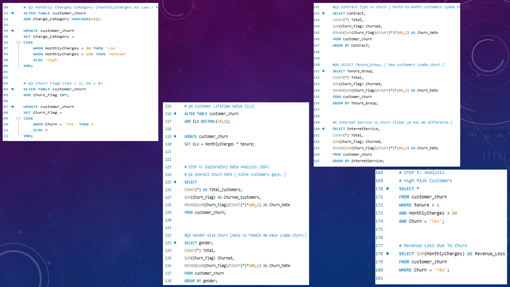

# Customer Retention & Analysis (SQL Project)

## Project Overview
This project analyzes customer churn behavior using SQL. 
The goal is to identify high-risk customers and understand the factors contributing to churn.

## Tools Used
SQL (MySQL)

## Dataset
Customer Retention Risk Analytics Dataset

## Project Steps
1. Database Creation
2. Data Cleaning
3. Feature Engineering
4. Exploratory Data Analysis
5. Business Insights

## Key Insights
- Customers with month-to-month contracts have the highest churn rate
- Customers with tenure less than 6 months churn the most
- High monthly charges customers are more likely to churn

## Business Recommendation
- Offer discounts for long-term contracts
- Provide onboarding support for new customers
##Customer  Analysis using SQL Processes To Work

